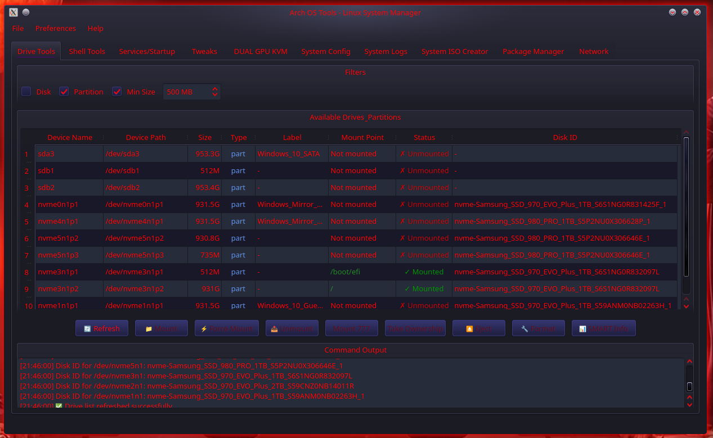
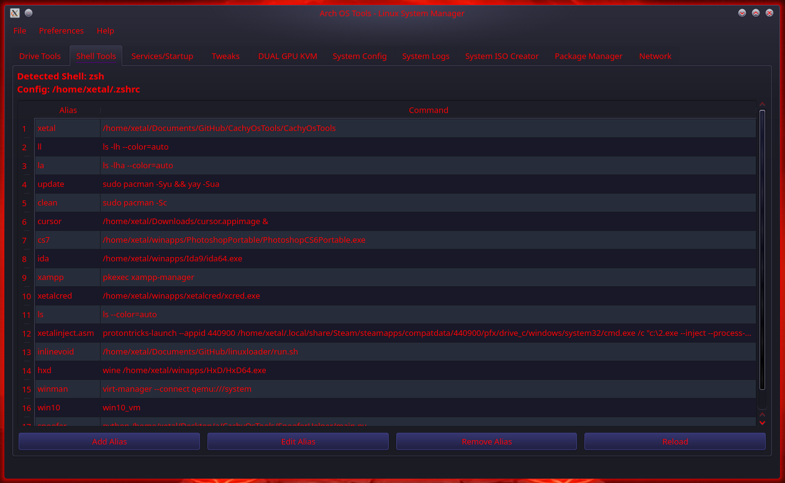
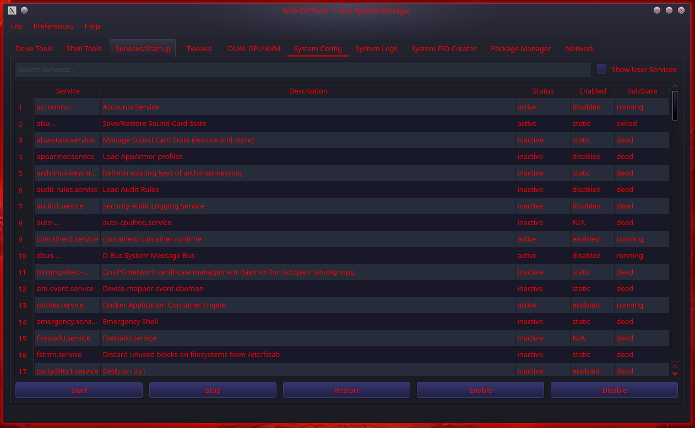
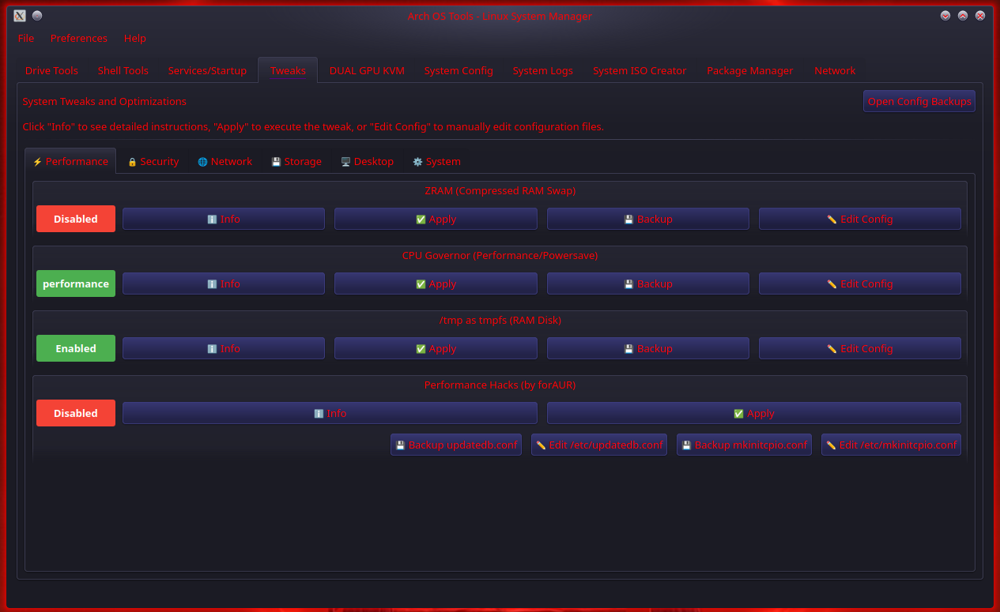
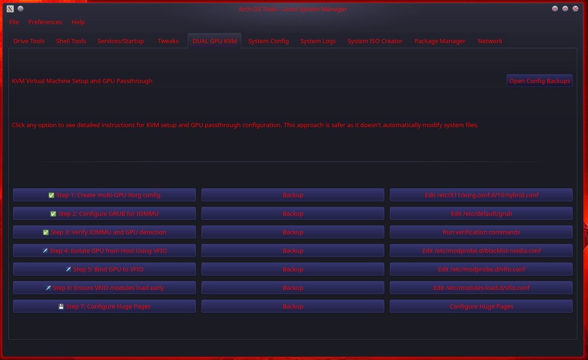
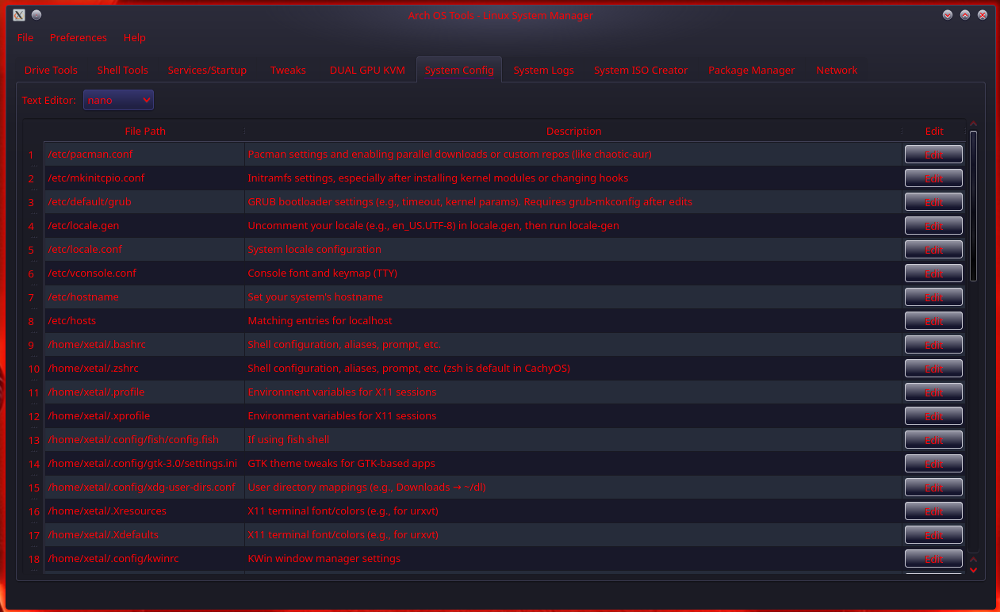
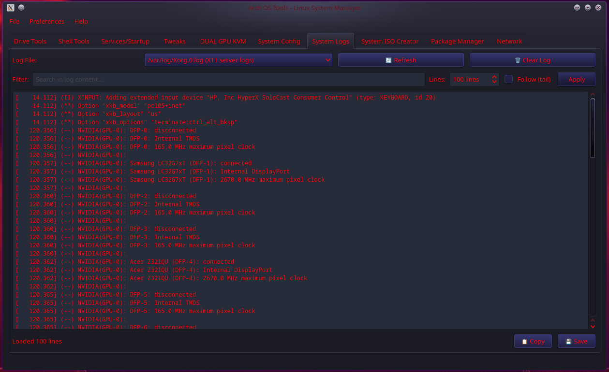
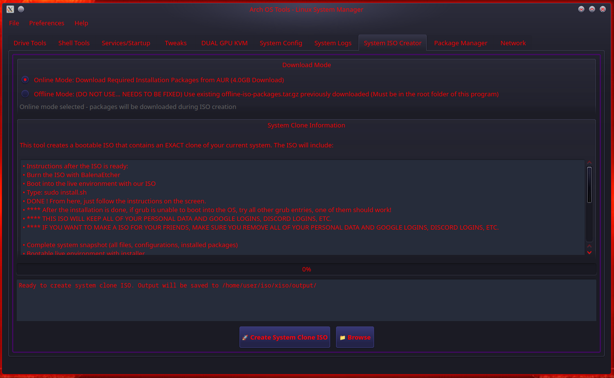
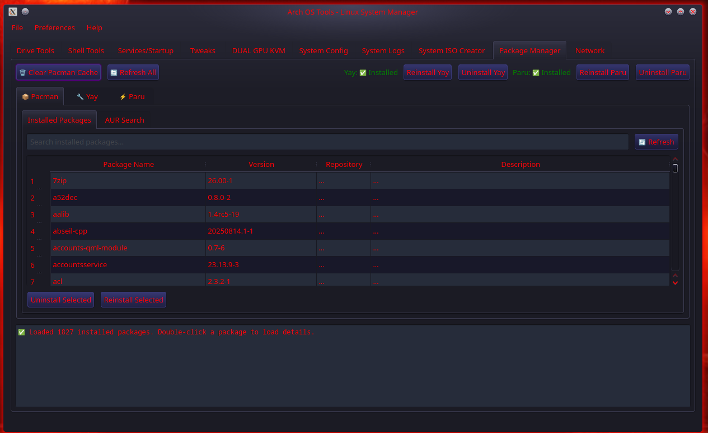
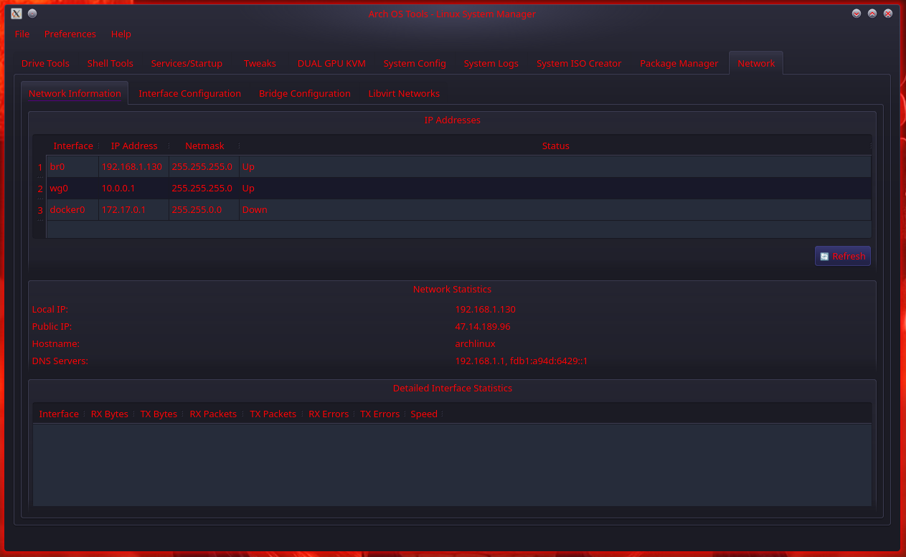

# CachyOsTools 🚀

<div align="center">
  
  <br>
  <em>A comprehensive system management tool for CachyOS and other Arch-based distributions.</em>
</div>

<br>

<div align="center">


</div>

---

## 📑 Table of Contents

- [Features](#-features)
- [Screenshots](#-logo-gallery)
- [Dependencies](#-dependencies)
- [Building](#-building)
- [Running](#-running)
- [Requirements](#-requirements)
- [Contributing](#-contributing)
- [License](#-license)

---

## ✨ Features

| Feature | Description |
|--------|-------------|
| **📦 Package Manager** | Search and install packages from official repos and AUR. Manage Yay/Paru AUR helpers (install, reinstall, uninstall). Browse installed packages, clear pacman cache, and install/remove packages with one click. |
| **💿 System ISO Creator** | Create a bootable system-clone ISO of your current installation. Full snapshot with installer, online or offline mode. Outputs to `~/iso/xiso/output`. |
| **💾 Drive Tools** | Mount, unmount, and manage storage devices and partitions. Filter by disk/partition/size, force mount, take ownership, eject, format. |
| **🖥️ Shell Tools** | View and manage shell aliases and environment. Quick access to shell configuration. |
| **⚙️ Services / Startup** | Start, stop, and configure system and user services. Toggle between system and user service lists. |
| **🔧 Tweaks** | System tweaks and optimizations: zram, CPU governor, tmpfs, performance hacks, mitigations, ptrace, hidepid, firewall, network (IPv6, DNS, TCP), storage (TRIM), desktop (hidden files), system (swappiness, I/O scheduler, THP, pacman, journald). Backup before applying. |
| **🖥️ Dual GPU KVM** | Step-by-step KVM setup and GPU passthrough: multi-GPU Xorg, GRUB, IOMMU verification, VFIO isolation and binding, huge pages. Config backups for each step. |
| **📄 System Config** | Open and edit system config files with your preferred text editor. |
| **📋 System Logs** | View and tail system log files (journald, Xorg, etc.) with live updates. |
| **💾 Backup** | System backup tools: define source and destination, run backups from the GUI. |
| **🔄 Restore** | System restore from existing backups. |
| **🌐 Network** | Network information (IPs, DNS), interface configuration, bridge setup, libvirt network management. |
| **⚙️ Preferences** | Show/hide tabs, and other app preferences. |

---

## 🎨 Logo Gallery

<div align="center">
  
  
  
  
  
  
  
  
  
  
</div>

---

## 📦 Dependencies

**Build (required):**
```bash
sudo pacman -S qt6-base qt6-tools cmake gcc make
```

**Optional (for Ninja builds):**
```bash
sudo pacman -S ninja
```

**Runtime (for full functionality):**
```bash
sudo pacman -S udisks2
```

**For System ISO Creator (archiso, rsync, tar, zstd):**  
The build script can install these automatically when you run `./build.sh` (it will prompt you). Or install manually:
```bash
sudo pacman -S archiso rsync tar zstd
```

---

## 🛠️ Building

**Recommended (interactive build + optional ISO deps install):**
```bash
git clone https://github.com/XetalEngine/CachyOsTools.git
cd CachyOsTools
chmod +x build.sh
./build.sh
```

When you run `./build.sh`, you can choose compiler (GCC/Clang), build system (Make/Ninja), and build type (Debug/Release). If packages required for the **System ISO Creator** (archiso, rsync, tar, zstd) are missing, the script will offer to install them via pacman (Arch-based only).

**Non-interactive ISO deps install (e.g. CI):**
```bash
./build.sh --install-iso-deps
```

**Manual build:**
```bash
mkdir build && cd build
cmake .. -DCMAKE_BUILD_TYPE=Release
make -j$(nproc)
```

---

## 🚀 Running

After building, run from the project root:
```bash
./CachyOsTools
```

Or use the run script (finds the latest build):
```bash
./run.sh
```

---

## 📋 Requirements

- **OS:** CachyOS (tested), other Arch-based distributions (e.g. Manjaro, EndeavourOS)
- **Qt:** Qt6 or Qt5
- **Compiler:** GCC or Clang with C++17 support
- **Build:** CMake 3.16+

---

## 🤝 Contributing

1. Fork the repository  
2. Create a feature branch (`git checkout -b feature/amazing`)  
3. Commit your changes (`git commit -m 'Add amazing feature'`)  
4. Push to the branch (`git push origin feature/amazing`)  
5. Open a Pull Request  

---

## 📄 License

This project is licensed under the **GNU General Public License v3 (GPLv3)**. See the [LICENSE](LICENSE) file for details.

- ✅ You can use, modify, and distribute this software  
- ✅ Modifications and improvements must remain open source  
- ✅ Derivative works must be licensed under GPLv3  
- ✅ Source code must be made available to users  

---

<div align="center">

**Made with ❤️ for the CachyOS and Arch community**

</div>
