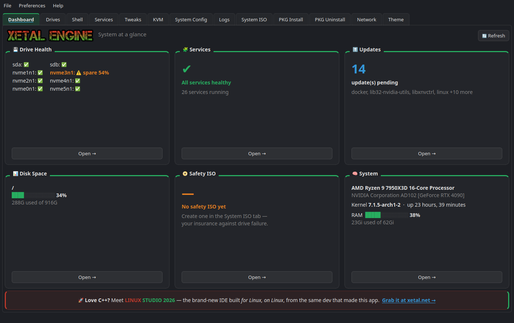
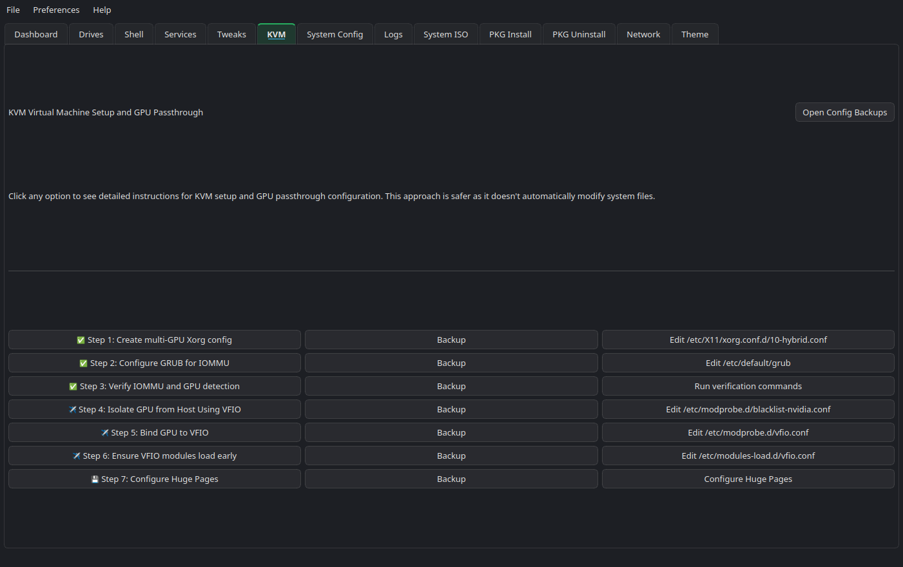

# CachyOsTools 🚀

<div align="center">
  
  <br>
  <em>A comprehensive system management tool for CachyOS and other Arch-based distributions.</em>
</div>

<br>

<div align="center">


</div>

---

## 📑 Table of Contents

- [Features](#-features)
- [Screenshots](#-screenshots)
- [Dependencies](#-dependencies)
- [Building](#-building)
- [Running](#-running)
- [Requirements](#-requirements)
- [Contributing](#-contributing)
- [License](#-license)

---

## ✨ Features

| Feature | Description |
|--------|-------------|
| **📊 Dashboard** | System at a glance: drive health (SMART), service health, pending updates, disk space, safety-ISO status, and hardware/kernel/RAM overview — with one-click jumps to each tab. |
| **💾 Drives** | Mount, unmount, and manage storage devices and partitions. Filter by disk/partition/size, force mount, take ownership, eject, format, SMART info, health check, and burn ISO → USB. |
| **🖥️ Shell** | View and manage shell aliases for your detected shell (bash/zsh). Add, edit, and remove aliases straight from the GUI. |
| **⚙️ Services** | Start, stop, restart, enable, and disable system and user services. Search, boot analysis, failed-service indicator, and per-service journal entries. |
| **🔧 Tweaks** | System tweaks and optimizations grouped by category: Performance (zram, CPU governor, tmpfs, turbo boost, gaming optimizations), Security (mitigations, ptrace, hidepid, firewall), Network (IPv6, DNS, TCP), Storage (TRIM), Desktop, and System (swappiness, I/O scheduler, THP, pacman, journald). Backup configs before applying. |
| **🖥️ KVM** | Step-by-step KVM setup and GPU passthrough: multi-GPU Xorg, GRUB IOMMU, VFIO isolation and binding, huge pages. Config backups for each step. |
| **📄 System Config** | Open and edit common system config files with your preferred editor, or the built-in sudo-capable editor. |
| **📋 Logs** | View and filter system logs and info (journald, Xorg, pacman, inxi hardware reports) with follow/tail support. |
| **💿 System ISO** | Create a bootable system-clone ISO of your current installation with a guided TUI installer. Exclude big folders/files and app configs, exact-clone or first-boot hardware adaptation (network/GPU/user/SSH), online or offline mode. |
| **📦 PKG Install** | Search and install packages from official repos and AUR. Manage Yay/Paru AUR helpers, browse installed packages, check updates, and clear the pacman cache. |
| **🗑️ PKG Uninstall** | Browse installed software sorted by size with source and install date, uninstall with dependency cleanup (-Rns), clean orphans and pacman cache. |
| **🌐 Network** | Network information (IPs, DNS, statistics), interface configuration, bridge setup, libvirt networks, Wi-Fi, saved connections, and open-ports overview. |
| **🎨 Theme** | Preset themes plus custom accent/background/text colors — applied instantly and remembered. |
| **💾 Backup / Restore** | System backup and restore tools (hidden by default — enable in Preferences → Tab Visibility). |
| **⚙️ Preferences** | Show/hide tabs, window size persistence, and other app preferences. |

---

## 📸 Screenshots

### 📊 Dashboard


### 💾 Drives


### 🖥️ Shell


### ⚙️ Services


### 🔧 Tweaks


### 🖥️ KVM


### 📄 System Config


### 📋 Logs


### 💿 System ISO


### 📦 PKG Install


### 🗑️ PKG Uninstall


### 🌐 Network


### 🎨 Theme


---

## 📦 Dependencies

**Build (required):**
```bash
sudo pacman -S qt6-base qt6-tools cmake gcc make
```

**Optional (for Ninja builds):**
```bash
sudo pacman -S ninja
```

**Runtime (for full functionality):**
```bash
sudo pacman -S udisks2
```

**For System ISO Creator (archiso, rsync, tar, zstd):**  
The build script can install these automatically when you run `./build.sh` (it will prompt you). Or install manually:
```bash
sudo pacman -S archiso rsync tar zstd
```

---

## 🛠️ Building

**Recommended (interactive build + optional ISO deps install):**
```bash
git clone https://github.com/XetalEngine/CachyOsTools.git
cd CachyOsTools
chmod +x build.sh
./build.sh
```

When you run `./build.sh`, you can choose compiler (GCC/Clang), build system (Make/Ninja), and build type (Debug/Release). If packages required for the **System ISO Creator** (archiso, rsync, tar, zstd) are missing, the script will offer to install them via pacman (Arch-based only).

**Non-interactive ISO deps install (e.g. CI):**
```bash
./build.sh --install-iso-deps
```

**Manual build:**
```bash
mkdir build && cd build
cmake .. -DCMAKE_BUILD_TYPE=Release
make -j$(nproc)
```

---

## 🚀 Running

After building, run from the project root:
```bash
./CachyOsTools
```

Or use the run script (finds the latest build):
```bash
./run.sh
```

---

## 📋 Requirements

- **OS:** CachyOS (tested), other Arch-based distributions (e.g. Manjaro, EndeavourOS)
- **Qt:** Qt6 or Qt5
- **Compiler:** GCC or Clang with C++17 support
- **Build:** CMake 3.16+

---

## 🤝 Contributing

1. Fork the repository  
2. Create a feature branch (`git checkout -b feature/amazing`)  
3. Commit your changes (`git commit -m 'Add amazing feature'`)  
4. Push to the branch (`git push origin feature/amazing`)  
5. Open a Pull Request  

---

## 📄 License

This project is licensed under the **GNU General Public License v3 (GPLv3)**. See the [LICENSE](LICENSE) file for details.

- ✅ You can use, modify, and distribute this software  
- ✅ Modifications and improvements must remain open source  
- ✅ Derivative works must be licensed under GPLv3  
- ✅ Source code must be made available to users  

---

<div align="center">

**Made with ❤️ for the CachyOS and Arch community**

</div>
