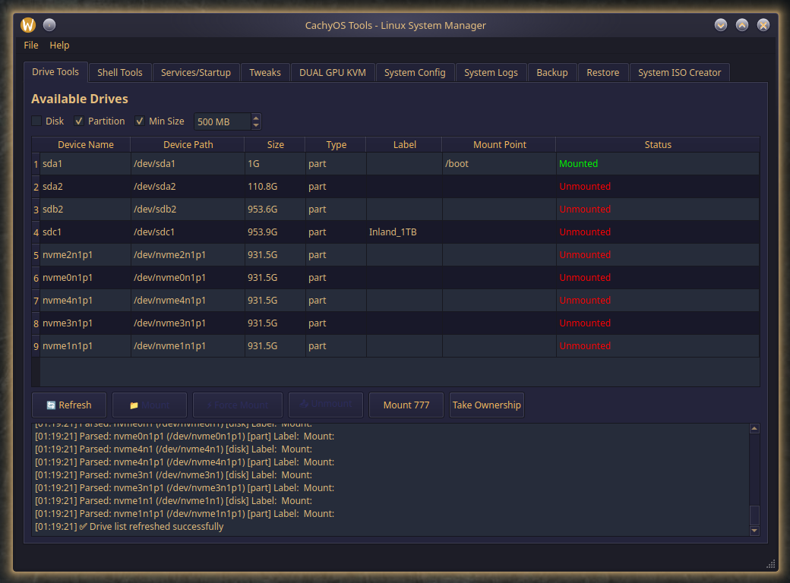

# CachyOsTools 🚀

<div align="center">
  
  <br>
  <em>A comprehensive system management tool for CachyOS (tested) and other Arch-based distributions.</em>
</div>


## ✨ Features

- **Drive Management** - Mount, unmount, and manage storage devices
- **System Tweaks** - Performance optimizations and system configurations
- **Service Management** - Start, stop, and configure system services
- **Backup & Restore** - System backup and restoration tools
- **GPU Passthrough** - KVM GPU passthrough configuration
- **System Monitoring** - Log viewing and system diagnostics

## 📦 Dependencies

Install the required dependencies:

```bash
sudo pacman -S qt6-base cmake gcc make
```

**Optional dependencies for full functionality:**
```bash
sudo pacman -S udisks2 systemd-analyze rsync
```

## 🛠️ Building

### Quick Build
```bash
git clone https://github.com/XetalEngine/CachyOsTools.git
cd CachyOsTools
chmod +x build.sh
./build.sh
```

### Manual Build
```bash
mkdir build && cd build
cmake ..
make -j$(nproc)
```

## 🚀 Running

After building, run the application:
```bash
./CachyOsTools
```

## 📋 Requirements

- **OS**: CachyOS (tested), other Arch-based distributions (untested)
- **Qt**: Qt6 or Qt5
- **Compiler**: GCC with C++17 support
- **Build Tools**: CMake 3.16+

## 🤝 Contributing

1. Fork the repository
2. Create a feature branch
3. Make your changes
4. Submit a pull request

## 📄 License

This project is licensed under the MIT License.

---

**Made with ❤️ for the CachyOS community** 